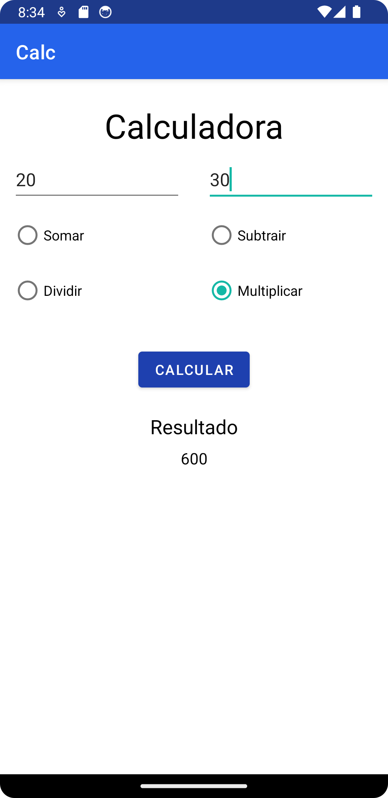

<h1 align="center">Calculadora</h1>

### Descrição
Este aplicativo foi desenvolvido como parte dos requisitos parciais para a disciplina de Introdução a Programação do Instituto Federal do Norte de Minas Gerais (IFNMG) no curso Técnico em Informática para Internet. Ele foi implementado em Java para a plataforma Android, e contém uma calculadora simples com opções para somar, subtrair, multiplicar e dividir dois números.

### Capturas de tela

### Licença

[ISC](LICENSE.md) © 2024 Kayo Souza
